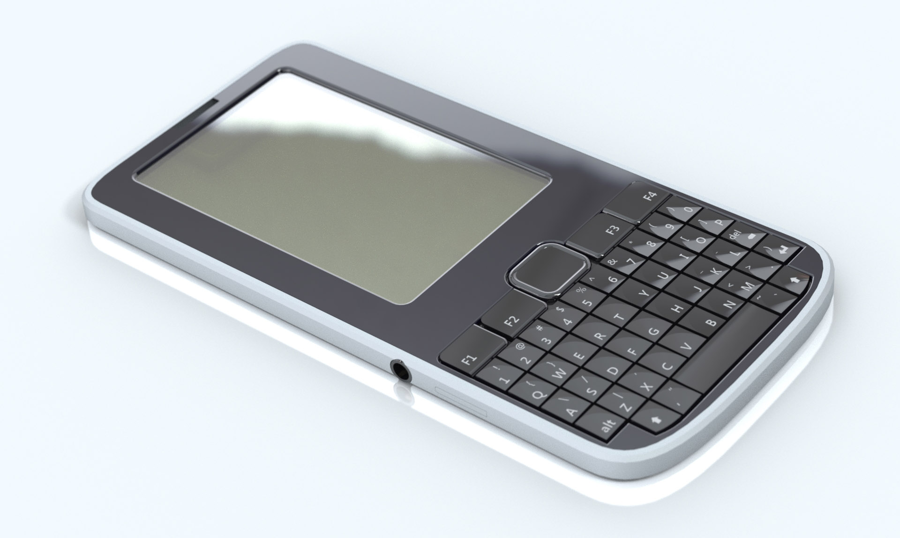
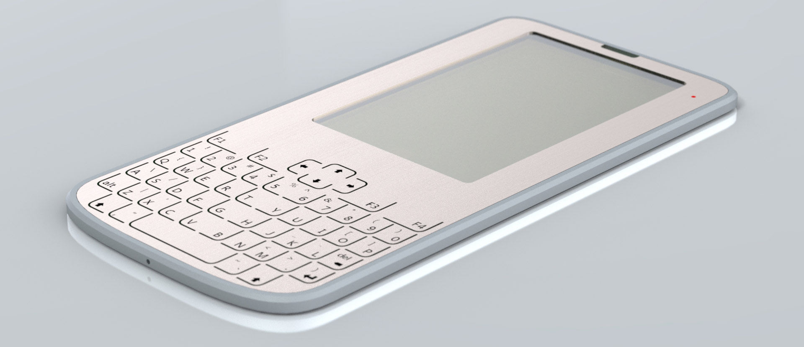

betrusted is a security enclave with human-friendly I/O. 

## The Birds, the Bees, and the Private Keys

A hacked phone or laptop means all of your passwords, private keys,
authenticator tokens and other secrets are potentially compromised. To
guard against this, systems are starting to incorporate physically
distinct
"[enclaves](https://developer.apple.com/documentation/security/certificate_key_and_trust_services/keys/storing_keys_in_the_secure_enclave)"
(aka [secure
elements](https://www.ledger.fr/2018/12/03/a-closer-look-into-ledger-security-the-secure-element/)
or [TPMs](https://en.wikipedia.org/wiki/Trusted_Platform_Module)). An
enclave is like having a safe in your house: even if the lock on the
front door is broken, the thief still can't access the contents of the
safe.

Today's enclaves protect only certain cryptographic secrets, such as
private keys. These enclaves lack human-friendly I/O and must delegate
the task of rendering and recording information to a less secure
host. As a result, remotely-controlled keyboard loggers and screen
scrapers can still access your data as it transits between the
enclave and you.

Protecting private keys is not the same thing as protecting your
naughty bits. betrusted adds Human-Computer Interaction (HCI)
elements to an enclave, ensuring that human-readable secrets are never
stored, displayed, or transmitted beyond the confines of the betrusted
device: betrusted is an enclave with human-friendly I/O.

## HCI-driven security model

[HCI](https://en.wikipedia.org/wiki/Human%E2%80%93computer_interaction)
stands for Human-Computer Interaction. It's about making computers
usable to every day people.

People use a wide range of languages, and some are illiterate. Thus a
key challenge for betrusted is striking a balance between best
security practices and a native-language HCI: more features means more
attack surfaces, while too few features renders the device too
difficult to use.

Therefore, correctly scoping the HCI aspect is critical. betrusted's
HCI scope includes native-language text messaging support, as well as
voice messaging for illiterate users.

* The [HCI rationale](/hci-rationale/) page explores the core HCI
requirements.
* The [betrusted architecture](/betrusted-architecture/) page covers
how HCI and security requirements come together into a single device.

## Building betrusted

Best security practice requires betrusted's full technology stack,
including silicon, device, OS, and UX, to be open for inspection and
verification by anyone.

The depth of this tech stack represents a significant engineering
effort, spanning multiple disciplines across the techology
spectrum. We welcome the contributions of all open-source developers.

The project is currently at the feasability and planning stage. The
current plan divides the project into three phases: a developer-only
alpha; an early-adopter beta; and finally, a consumer-ready product.

Learn more about the [betrusted development plan](/dev-plan/).

### Developer-Only Alpha

The alpha hardware is implemented using a FPGA containing a RISC-V
soft core. The primary goal of this phase is to solidify the specs of
the eventual betrusted ASIC through development and testing on a
looks-ilke, works-like prototype.

Above is a concept rendering of what the alpha hardware might look
like. Measuring at 5.5mm thick, the enclave houses an oversized
battery to complement the high leakage power of the FPGA. A superset
of proposed features are represented in this prototype to facilitate
HCI experimentation.

Read more about the [alpha hardware FPGA](/betrusted-architecture/#developer-fpga-system).

### Early-Adopter Beta

The second phase translates the FPGA design into a proper ASIC
enclave. This brings about orders of magnitude in power saving and
improved performance, allowing the hardware to be sleeker while
supporting a longer battery life. This phase aims to harden the
codebase, while validating [novel technological
concepts](https://github.com/betrusted-io/betrusted-wiki/wiki/ASIC-hardening)
built into the ASIC meant to harden against supply chain attacks.

In this concept, betrusted measures in at about 3.5mm thick. Achieving
such a thin form factor will require developing a novel keyboard
element and incorporating features such as inductive charging.

Read more about the [beta hardware custom SoC](/betrusted-architecture/#custom-soc).

### Consumer-Ready Product

The final phase is a "consumer ready product". As the name implies,
the product will be ready to use out of the box, with special effort
put into the out of box user experience and documentation such that
anyone can set up and use betrusted to communicate, transact, and
safeguard secret data.

This phase will incorporate a substantial amount of learning from the
first two phases. There is no placeholder concept rendering, as the
final design will be born of the unknown unknowns.

# More Info

Please visit the [betrusted
wiki](https://github.com/betrusted-io/betrusted-wiki/wiki) for more
technical information. The main [betrusted github
repository](https://github.com/betrusted-io) will also begin to fill
in as more technical details come online.

## Who is behind betrusted?

The betrusted-io github repository's people page [lists the
developers](https://github.com/orgs/betrusted-io/people) that have [elected to reveal their
participation
publicly](https://help.github.com/en/articles/publicizing-or-hiding-organization-membership).

The administrative contact for the betrusted.io project is [Andrew
'bunnie' Huang](https://en.wikipedia.org/wiki/Andrew_Huang_(hacker))
([@bunniestudios](https://twitter.com/bunniestudios)/[blog](https://bunniestudios.com)).

