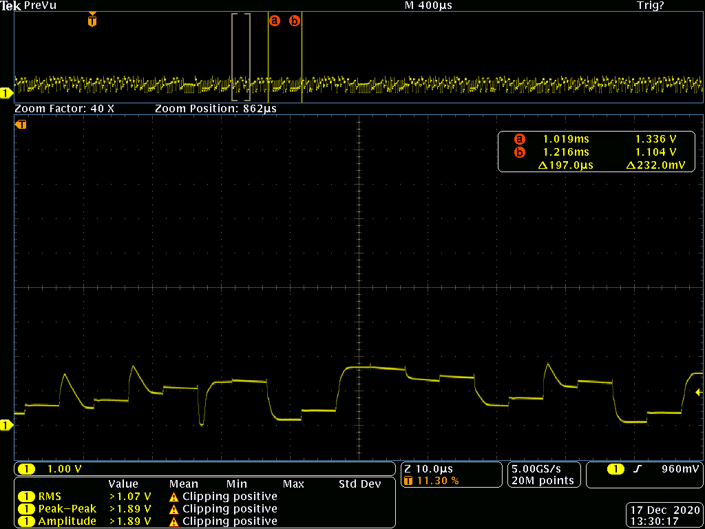
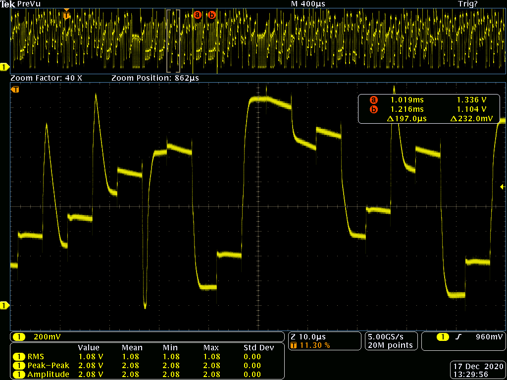

# Avalanche Noise Source Design

# Motivation

A high quality noise source is necessary for any good crytpographic
enclave. In fact, multiple high quality noise sources are preferable,
if the budget allows.

On-die RNGs such as ring-oscillator based RNGs leverage the
metastability of sampling circuits to translate timing jitter into a
random stream of bits. These are area and power efficient but are also
tricky to verify. They are particularly vulnerable to [subtle mask-editing
attacks](https://sharps.org/wp-content/uploads/BECKER-CHES.pdf).

In addition to an on-die RNG, betrusted's entropy pool in reinforced
by an externally testable noise source. Avalanche noise sources fit
the bill, as they can delivery reasonably high quality entropy and
verification can be done using a low-end "economy" oscilloscope.

The challenges of avalanche noise sources include the need for high
(10-30V) voltages (and correspondingly high power consumption), and
there the amount of noise generated depends on subtleties such as the
engineering of the PN junction and the ambient temperature. Here we
discuss the design and implementation of an avalanche noise source
suitable for integration into a low-power, small-footprint mobile
device.

# Avalanche Breakdown Theory

Readers who just want to skip to the design can safely jump over this
section. However, few discussions of avalanche noise sources address
the theory of the noise source, which is important to understand when
trying to rationalize power and component selection. If you plan to
adjust or tweak the design, it's recommended you at least skim this
section.

Avalanche breakdown is essentially a miniature particle accelerator, where electrons that enter a PN junction's depletion region (through mechanisms that include thermal noise) are accelerated across an electrical field, to the point where new electron-hole pairs are generated when these high-energy electrons collide with atoms in the depletion region, creating an amplification cascade with low reproducibility.

An approximate analogy is an inflatable pool filled with water. The height of the pool is the potential barrier of the reverse-biased PN junction. A hose feeding water into the pool represents a constant current of electrons. The volume of the pool can be thought of as the depletion capacitance, that is, the capacitor created by the region of the junction that is void of carriers due to natural drift and diffusion effects. As water trickles into the pool, the water level rises and eventually forms a meniscus. Random disturbances, such as ripples on the surface due to wind, eventually cause the meniscus to crest over the edge of the pool. The water flowing over the edge pushes down on the inflatable pool's side, causing more water to flow, until the level has reduced to a point where the inflatable pool's side can snap back into its original shape, thus restarting the cycle of filling, cresting, and breakdown. The unpredictability of when and where the breakdown might happen, and how much water flows out during the event, is analogous to the entropy generated by the avalanche effect in a PN junction.

The electrical characteristic of avalanche noise biased by a constant current source is a “sawtooth” waveform: a linear ramp up in voltage as the capacitance of the depletion region charges to the point where the electric field becomes large enough to initiate the cascade, and then a sharp drop off in voltage as the cascade rapidly discharges the junction capacitance. The cascade then abruptly halts once the field is no longer strong enough to sustain the cascade effect, leading to a subsequent cycle of charging and breakdown.

Avalanche diodes are high voltage devices because of the physics
behind them. The breakdown voltage of the junction is controlled by
the doping levels of the P and N regions:

Vbr = (Ecr^2 * Esi / 2q) * ((Na + Nd) / Na * Nd)


* Ecr is the critical value of the electrical field, a physical constant that ranges from 210^5 V/cm to 810^5 V/cm depending on the doping
* Esi is the dielectric constant of silicon
* q is the elementary charge of an electron
* Na is the doping concentration of the P region
* Nd is the doping concentration of the N region

Vbr increases as the temperature increases: as temperature goes up, so
does lattice vibrations. Electrons are thus more likely to be
scattered before they can be accelerated to a sufficient momentum to
initiate the avalanche cascade. Thus a given junction engineered for
a fixed Vbr exhibits decreased noise at higher temperatures. When confirming
the performance of an avalanche noise source, it's therefore important
to confirm its performance at the highest expected operating temperatures.

In order to engineer a low voltage breakdown, the doping Na and Nd
must be so high that the depletion region shrinks to a distance on the
order of 10nm, such that quantum tunneling becomes the dominant
effect. Quantum tunneling is synonymous with the "zener" effect, and
is a different physical process which generates less noise. Thus for
reverse-breakdown junctions that operate below 4.5-6.5V, the process
is predominantly a zener effect and not as suitable for noise
generation. This explains why avalanche noise generators must operate
at higher voltages.

Note that Vbr decreases as temperature increases for the zener effect,
opposite the avalanche effect. Thus "zener diodes" sold for the
purpose of voltage regulation are actually engineered to use a
combination of quantum zener plus avalanche effects, as they have
opposite temperature coefficients and can lead to a more
temperature-stable voltage reference.

The hybrid engineering of the zener diodes has lead to some confusion
when selecting suitable parts as an avalanche noise source. However,
zener diodes above 7V or so start to rely more and more on avalanche
breakdown, so one may more accurately call a high voltage zener diode
an avalanche breakdown diode.

Note that avalanche diodes to be used as voltage references are
engineered to be less suitable as a noise source. Obviously, if the
goal of the Vbr is as a voltage reference, reduced noise is highly
desired. Generally, noise can be reduced by operating the diode at a
higher current: more carriers means more opportunities to initiate the
avalanche cascade. However, simply cranking up the current would also
waste power. Thus avalanche diodes engineered as a voltage reference
are designed so that the junctions are "leaky" compared to a typical
rectifier application -- perhaps through a very large area junction,
with trace amounts of minority carrier dopants added to seed reverse
leakage. Increasing low-level reverse-bias leakage reduces avalanche
noise at lower current levels, because the tiny leakage helps "seed"
the avalanche effect more consistency.

Thus when evaluating devices, the following are positively correlated
with increased noise generation:

* Higher breakdown voltage
* Lower leakage current in reverse bias

A variety of inexpensive zener regulators as well as ESD protection
diodes meet this criteria. ESD protection diodes in particular care
little about how much avalanche noise is generated, and may prioritize
lower leakage in reverse bias instead.

### NPN transitor junctions

A discussion of B-E junctions of NPN transistors as an avalanche
noise source is warranted due to its popularity in inexpensive
noise sources. B-E junctions are engineered with very heavy doping on
the E side, and light doping on the B side. This causes a very narrow
depletion region on the emitter, and a large depletion region on the B
side. In this case Vbr is dominated by Na, e.g.:

Vbr ~ 1/Na

The heavier the emitter doping, the lower the Vbr. And emitters on NPN
transistor are heavily doped, so Vbr tends to be in a the range of
5-12V. The low breakdown voltage and wide availability of NPN
transistors thus makes the device appealing.

Unfortunately, the threshold between zener breakdown and avalanche
isn't a clear line; in fact, NPN transistors with breakdowns
approaching the 5V range exhibit behavior closer to zener breakdown
(quantum tunneling) and are thus less suitable as a noise source.

Furthermore, because NPN transitors are not well-characterized for
their reverse B-E breakdown, the quality of the noise generated can
vary widely between manufacturers and models. The Internet also
contains anecdotes that over time the B-E junction "wears out" over
a period months and the quality of noise degrades, but there is no
discussion of mechanism or backup with measurements.

# Circuit Design

Thus, the desired properties for the mobile-friendly avalanche noise
circuit are:

* Constant current source, adjustable to uA-range
* High voltage compliance on the constant current source (to 30V+)
* Post-noise source amplification/signal conditioning
* Small footprint (<1 cm^2)
* Low active power (< 5mW)
* Standby mode

Fortunately, most of these requirements are met by a class of regulators
meant for controlling LCD blacklights and/or white LEDs. Photonic flux
of an LED is proportional to current (not voltage) and thus for consistent
light output across a wide range of devices LED regulators are almost
always constant current sources. The desire to stack multiple LEDs on
top of each other means almost all of these devices have very high
voltage compliance as well.

The [TPS61158](http://www.ti.com/product/TPS61158) is identified as
one of many suitable devices, this one chosen because it has a voltage
cap at 30V, and features reasonable standby power and quiescent
current draw. There may be others with even better characteristics,
but the search stopped with this part because it met the desired
properties of the circuit.

The final configuration simply replaces the LED string with a PN
junction in reverse bias, along with a resistor stacked above the PN
junction to provide some voltage compliance for the noise to generate.
The voltage compliance is pure resistive power loss, so we target
around a 1-2V compliance voltage, as the anticipated noise voltage is
around 500mVp-p.

The main risk point of the circuit is operation at extremely low
currents; the circuit is normally specified to provide 20mA of
current, and we are operating it around a few uA.  The low current
operation may lead to instability in the regulator control loop and
cause problems with circuit startup, so this needs to be characterized
carefully.


[source repo](https://github.com/betrusted-io/betrusted-hardware-xt.git)

The cathode of the noise generator is AC-coupled to a resistive
divider that centers the noise within the sweet spot of an amplifier
that provides a 6:1 gain on the generated noise. More important than
the voltage gain is the impedance matching to the sampling circuit.
The noise generator runs at a very low current, and thus is incapable
of driving any significant load. Thus even if the amplitude of the
noise source was sufficient for direct sampling or use, a signal
conditioning buffer of some sort would still be necessary to provide
sufficient drive current for the ultimate circuit load. The target
sampling circuit in this case is a 1MSPS 12-bit ADC with a 0-1V input
range.

# Circuit Characterization

Several devices were evaluated for their noise performance
using the circuit as designed:

|Part number	|Mfg	        |Vbr   |noise mVpp |Type |
|---------------|---------------|------|-----------|-----|
|MMBT2222A-7-F	|Diodes Inc	|7.52  |69.6	   |NPN  |
|MMBT3904LT1G	|On semi	|7.8   |80.4	   |NPN  |
|MMBT2484	|On semi	|10.65 |571	   |NPN  |
|BSV52LT1G	|On semi	|7.39  |74.5	   |NPN  |
|MMBT100	|On semi	|8.43  |157	   |NPN  |
|MMBT2222A	|On semi	|8.69  |107	   |NPN  |
|MMBT3904-TP	|Microcom	|8.66  |115	   |NPN  |
|MMSZ15T1G	|On semi	|15.34 |379	   |zener|
|DDZ9V1C-7	|Diodes Inc	|9.31  |89	   |zener|
|MMSZ525BT1G	|On semi	|24.3  |951	   |zener|

Vbr is the measured breakdown voltage at a 3.16uA bias
current and roughly 3V of compliance provided by the
ballast resistor above the diode.


Note that the measurement limit for noise is around 70mVp-p, so some
NPN transistors were possibly generating little to no noise.  In
general, it was observed that devices with higher breakdown voltages
would generate more noise.

We settled on a 15V zener diode (MMSZ15T1G) as the initial device for
noise generation. This device is squarely in the middle of the range
of the TPS61158 regulator, is comfortably above the zener threshold,
yet not excessively high (as a higher voltage would lead to higher
power dissipation), and is guaranteed by the manufacturer to breakdown
at a certain voltage. Although more noise was witnessed on a 24V
breakdown device, operation near the cutoff threshold of the TPS61158
made the circuit unreliable under some startup conditions. Any lack in
amplitude could be restored anyways by the follow-up signal
conditioning circuitry.


Above is the initial noise trace as measured by the circuit. One
key observation is that the maximum frequency of the noise is quite
high (>> 1MHz), which leads to some bandwidth degradation as it
feeds into the low-power op amp (GBW of 1.4 MHz).

The bandwidth of noise, and to a lesser extent the amplitude, can
be tuned by placing a small capacitor in parallel with the avalanche
junction. In this case, the MMSZ15T1G has about a 110pF or so depletion
capacitance, so the parallel tuning capacitor should be sized around one
order of magnitude larger. Basically what the parallel capacitor does
is bleed away some of the current feeding into the junction, causing
it to build up a field more slowly and thus reducing the bandwidth.

With a 1500pF capacitor placed in parallel with the noise source,
we observe the following optimized noise trace, measured after
the signal conditioning amplifier.


The noise in this case has a bandwidth that is suitable for sampling
by the 1MSPS ADC, and the amplitude is close to 0-1V.

The optimized circuit has the following characteristics:

* 0.526mA @ 3.3V active current draw
* 0.0124mA @ 3.3V standby current draw (mostly LDO leakage, not shown in circuit)
* successfully boots at 2.8V and 4.4V
* generates noise at 0C and 80C. At 0C the noise is about 50% larger in amplitude, at 80C it's about 50% smaller in amplitude.

Notes:
* The voltage on the regulation capacitor has a
non-trivial amount of ripple. This probably applies a signature on the
noise generated.
* The TPS61158 draws about 1uA through the feedback
pin, which means of the target 4.2uA bias current, 1 uA is shunted into
the feedback pin (resulting in 3.2uA going into the diode).

# Next Iteration

The overall footprint is around 1 cm^2, and can be optimized further
by going to a smaller inductor. The inductor initially chosen for the
test circuit is greatly oversized for the application (just in case
higher current were needed for testing). A much smaller inductor,
perhaps an 0603 or 0805 part, could be used thus reducing the
footprint even further. For example, a TDK MLZ1608M220WT000 is in an
0603 package and saturates at 55mA. This should be sufficient given
the operating current of 3uA, although there is some question about
the inductor's performance during power-on.

A smaller footprint for the noise generating diode could be used as well.
The initial layout used a SOT-23 footprint to accommodate a wide variety of
devices but the final circuit could use a SOD-523. The following devices
are candidates to be tested:

* BZT585B15T, BZT585B18T - zener diode, intended for voltage reference purposes
* PESD12VS1UB, PESD15VS1UB - TVS diode, intended for circuit protection

# Modular Noise Generator

A design review had introduced the idea of the "[modular noise
generator](https://github.com/waywardgeek/infnoise)" to me. This is, in theory,
a noise source that is less sensitive to environmental factors like EM interference
and temperature, and it has a very small start-up lag; in theory, it could be
producing noise in dozens of microseconds, versus an avalanche generator
which has to reach a certain fairly high voltage before it can function, a process
that may take tens of milliseconds.

The modular noise generator is basically a modular voltage multiplier
that attempts to continuously multiply the voltage stored on a
capacitor, modulo the voltage rails. It can be thought of a successive
approximation ADC (SAR ADC) that keeps approximating beyond the noise
floor of the ADC. Consider, for example, a 12-bit ADC; it can't
meaningfully quantize anything beyond an SNR of 72.24dB. However, nothing
stops you from running the 12-bit SAR ADC for four more cycles and
getting a 16-bit result out of it; it's just that the last 4 bits are
all noise and functionally useless as far as an ADC. However, as a TRNG,
those extra bits just keep getting better and better!

Thus, a modular noise generator is an "infinite-precision" SAR ADC
made out of finite-precision parts; so, beyond the first dozen bits or
so (which should be discarded), every successive bit that comes out of
it should basically be a high quality entropy source.

Before committing to the avalanche generator, I decided to build a retrofit for
the PVT version of Precursor (née Betrusted) that could drop a modular noise
generator in place of the avalanche generator, so that I could evaluate its
capabilities. The TL;DR is that we are still going with the avalanche generator,
but I wanted to write up my findings with the noise source because it does
have merit, but for various technical and project risk reasons I have decided
not to adopt it.

## Design


Above is a block diagram of the modular noise generator as implemented
in the drop-in prototype. In a mobile device, power consumption and
footprint are of paramount importance; thus, I took the [original
Infinite Noise Generator reference
design](https://raw.githubusercontent.com/waywardgeek/infnoise/master/images/infnoise.png)
and halved the number of devices required by multiplexing the
comparator and op amp using an analog switch; notably, the design is
already a switched-capacitor design that required analog switches, so
the additional switches necessary to do the multiplexing come at
virtually zero power and footprint cost.

The reference design has two op-amps, each consuming 0.6mA, and two
comparators, each consuming 0.22mA, for a total of 1.64mA (typ
_quiescent_) at 3.3V = 5.4mW, running at 300kbps. The avalanche generator, on
the other hand, consumes 0.526mA (typ _operational_) at 3.3V = 1.7mW and
generates entropy at rates at around 800kbps.

When comparing power numbers, note the following differences:
- 5.4mW for the modular noise generator is quiescent (idle, not generating noise)
- 1.7mW for the avalanche generator is on and generating noise
- The 7-series XADC power is not counted in the avalanche generator number; it's
   already powered on for other uses. However, as a reference, the Vivado power
   estimator run on the actual design puts the power consumption of the XADC at about
   1-2mW. Note this conflicts with the 34mW given by the 7-series "XPE" spreadsheet;
   I cannot find an explanation for this, but generally the output of the analysis tool
   is more accurate than the spreadsheet estimator.
   
While a few mW is only a tiny fraction of the "on" power of a
Precursor, I felt that the modular noise generator had potential to
operate at even lower powers.

By time-mutiplexing the op-amps and comparators, I'm able to halve the
power consumption, and slightly reduce the footprint. By reducing the
entropy rate to ~200kbps, I'm able to use lower-power devices, resulting
in a current consumption of 65uA @ 1.8V (note the lower Vdd). At this
power consumption, the bias resistors matter, so I add an extra 9uA for
the Vref bias ladder for a total of 74uA @ 1.8V = 0.13mW. This power
consumptions is virtually negligible, and is small enough that power
control to the generator is done by directly powering the op-amp and
comparator off of an FPGA GPIO line.

If a higher entropy rate is desired, this could be accomplished by
swapping out the TLV9001 op-amp for a pin-compatible TLV9061 device.
The figure-of-merit to pay attention to is the settling time (t_s) into
a capcitive load, which is specified in the datasheets. The TLV9001
has a settling time of 2.5-3us at an Iq of 60uA; the TLV9061 has a
settling time of 0.5-1us at an Iq of 538uA. Thus one can improve the speed
of the generator by about 3x, at a roughly 7.5x increase in power.


The schematic as realized is shown above. Here are some notes about the
implementation considerations:

- The decap (C1) for the op-amps is conservative because the power source is an
  FPGA I/O pin. It is a balance between decap performance and potentially damaging
  the FPGA I/O during the initial turn-on transient.
- Bigger resistors make more thermal noise, and consume less power, so the VREF for the
  comparator is derived from 100k resistors (instead of 10k). The downside is potential
  vulnerability to stray EM, but the 1000pF capacitor and careful layout helps mitigate that.
  It's a balance between thermal noise generation and environmental sensitivity.
- We set the loop gain at 1.82, following the Infinite Noise Generator's lead. The argument
  given is that by reducing the entropy from "perfect", we can measure it. The intention is
  this source would be fed into a whitener after analysis. In practice, it also seems that
  a loop gain of 2.0 leads to the generator falling into stable states; likely due to
  hysteresis and component tolerances conspiring to stick it one way or the other. Thus there
  is some art in tuning the generator.
- The Infinite Noise Generator also has a 10k "mystery resistor" (R9 on its schematic) which
  I'm guessing is there to ensure that the generator always starts up, and does not get
  stuck in a stable state. In this design, the 1M dividers across the storage capacitors
  can be biased by changing out resistors, as necessary to ensure a positive startup condition.
- The load capacitors C3 and C4 are set at 1000pF so as to minimize the impact of charge
  sharing from the analog switch U3 (~12pF). The 74LVC4066B was picked over TS3A4751 primarily
  on the basis of the parasitic capacitance figure of merit. I replaced these with 100pF
  capacitors to see if it had a large impact on settling time; it did not, but there is a
  noticeable droop when the capacitor is in storage and a bump during switching transients, causing
  a significant reduction in entropy. Therefore, the larger capacitance is preferred.
  Note that the 1000pF capacitor is expected to contribute about 0.15mW of power
  (fsw * 0.5 * C * V^2, fsw = 200kHz, C=1000pF, V = 1.8 * 0.707)

For the design as shown above to work, it's crucial for clocks PHASE0 and PHASE1 to be
non-overlapping. This ensures that there is no bleed-through of charge from CAP0 to CAP1.
We use two GPIOs from the FPGA to generate these clocks.


Above is the evaluation module as assembled, pictured on top of a thumb nail.


Above is the evaluation module mounted onto a Precursor. Castellations
on the edge of the board plus one through-hole are used to contact
existing points used in the existing avalanche generator, which are
then re-purposed to drive the modular noise generator through the magic
of FPGAs.

## Characterization

The following diagrams are made with the modular noise generator "as
designed" (gain=1.82, Cl=1000pF) unless otherwise noted. The FPGA is generating
non-overlapping clocks with a period of ~5us, with a 50ns non-overlap dead time
in between each phase as seen below:


Below is probably the most illuminating image detailing how the design functions.
The yellow trace is CAP1, and the cyan trace is CAP_A. As you can see, CAP_A assumes
a new value at twice the rate of CAP1, as it is the output after the analog switches
that interleave between the two capacitors. The CAP_A node is nice and crisp, as
expected. The CAP1 node shows the settling time of the op-amp: as the op-amp is multiplexed
between between two capacitors, half the time the capacitor is driven by the op-amp,
and the other half of the time it's being "read out" as the input to the op-amp.
One can see that the op-amp uses up almost all of the alloted 5us to settle to its
final value. Experiments to reduce the settling time indicate this is about as fast
as you can realistically run the circuit with this op-amp; if the period is shortened,
the generator ends up in a stable state.


The image below compares the value on CAP1 (cyan) to the output of the TRNG (yellow).


Below zooms in more to focus on the settling time of the op-amp into the capacitor.


Below shows the output of the TRNG compared to the voltage on the CAPA node. If you
draw an imaginary line at VDD/2 through the cyan trace, you get the yellow trace.


Below compares a non-overlapping clock phase to CAP1. Here you can see how when the
phase is driven high, the capacitor is engaged to the op-amp and it changes value;
and when it is low, it's isolated and suitable for readout.


Below are images showing what happens when a 100pF capacitor is used instead of a 100pF
capacitor for storage. The scale is exaggerated on the second image so that the droop
issues are clearly visible.





It's expected that this noise source should fall short of
generating 1 bit of entropy per bit (should be 0.86).

`ent` returns the following values:

```
Entropy = 7.847409 bits per byte.
Entropy = 7.847957 bits per byte.
Entropy = 7.847004 bits per byte.
```

Which is about 0.98 bits of entropy per bit. Dieharder's birthdays
also flags this reduction of entropy:

```
   diehard_birthdays|   0|       100|     100|0.00006712|   WEAK
```

The higher-than-expected performance may be due to the fact that
this characterization run was only considering the output of one
phase of the modular multiplier, and therefore the bitrate was half
of the expected value and we're throwing away every other sample.

For the next run, I increased the loop gain to 1.92 should improve
entropy to about 0.93 bits per bit. This was done by changing out the
gain resistor R5 to 9.1k. This change also necessitated removing R7
to force a bias onto one of the storage caps, otherwise the design
tended to phase in and out of a stable state, causing long runs
of 1's or 0's. 

In this run, we also correct the sampling rate error.

`ent` returns the following values:

```
Entropy = 7.541152 bits per byte.
Entropy = 7.547037 bits per byte.
Entropy = 7.542359 bits per byte.
```

Which is about 0.945 bits per bit of entropy and closer to the
expected result.

Dieharder is not at all happy about the reduction in entropy:

```
   diehard_birthdays|   0|       100|     100|0.00000000|  FAILED
```

## Conclusions

The modular noise source is a compact, low power noise source. The
design as evaluated produced a reduce rate of entropy, but had
very good power numbers. As expected, the design does not produce
a full bit of entropy per bit, and attempts to coax it into the realm
of producing full entropy revealed that the design is liable to
fall into stable states when the entropy rate is too high. 

When compared to the existing avalanche generator, we find that:

- Area: modular noise generator is slightly smaller
- Power: avalanche = 1.7mW; modular noise generator can reduce to as
  little as 0.13mW, but practically speaking we'd tune the generator
  to ~1mW for greater entropy rates. So the power is about the same,
  and either way, negligible compared to the system.
- Entropy rate: at 0.13mW, we generate ~200kbps of entropy per second;
  at 1mW we may be able to improve that to 400-500kbps. Avalanche
  can generate about 800kbps. 
- Entropy quality: modular noise generator outputs ~0.86-0.95 bits
  of entropy. Avalanche generator outputs close to 1.0 bits of entropy
  per bit at full rate without an additional whitener.
- Stability: the reduced entropy of the modular noise generator is
  necessitated by the fact that it falls into stable (e.g. constant output)
  states if the entropy rate gets too high. The avalanche effect is robust
  so long as the bias voltage is high enough, and the temperature is lower than
  80C.
- Startup lag: in the modular noise generator, the first 20-30 bits of
  entropy are not usable, so the lag is about 0.15ms. The avalanche generator
  requires a high-voltage regulator to stabilize, which takes about 20-50ms. 

Thus, while the modular noise generator can improve on area and power, from
a system engineering perspective, these are not significant compared to
the rest of Precursor. Entropy rate generation, while inferior, is probably
acceptable from a system design standpoint.

However, the greatest concerns are around entropy quality and
stability. The controllable quality of the modular noise source is
argued to be a feature, not a bug -- it may allow for simple and fast
verification that the device is working correctly; and furthermore,
all entropy sources in Precursor will be coupled, in software, with an
optional cryptographic whitening function for defense-in-depth.

Thus the biggest concern I have with dropping the modular noise
generator into the design at the 11th hour is the observed behavior of
the noise generator falling into stable states. The results reported
in the analysis above are always done after some bodges to work around
any stable states that were encountered. Some tests even show the
generator phasing in and out of a stuck-1 or -0 condition. The main
culprits are probably the hysteresis of the comparator, plus component
tolerances that tend to bias/stack the result in a particular direction
such that when the loop gain is too high the system will get stuck.

That I cannot ascribe an analytical solution to this is problematic,
and it's especially problematic if the situation is aggravated by corner
cases in the analog component tolerances -- determining the extent
of this sensitivity could only come out in mass production, at which
point it's too late to fix.

For this reason, the modular noise generator is not swapped into the
Precursor design, and we stay with the avalanche generator.

The primary concerns raised around using the avalanche generator are
as follows:

- Avalanche generators could be vulnerable to remote EM injection attacks,
  where an adversary attempts to influence the output of the generator by
  irradiating the target with radio waves of sufficient power to swamp out
  the noise created by the avalanche diode. In Precursor, this is mitigated
  by putting a robust farday cage around the trusted domain; the amount of
  power required to induce this failure is probably high enough that it would
  damage other circuits and/or cause physical injury to nearby people.
- Some avalanche generators are known to be vulnerable to aging, but this
  is, anecdotally, linked to the use of NPN transistors as avalanche generators.
  In Precursor, we use a higher-voltage diode whose junction was explicitly
  engineered for the purpose of long-term operation in an avalanche mode.
- Avalanche generators have an entropy output that changes with temperature.
  However, Precursor is engineered to produce sufficient output amplitude
  across a range from 0-80C. Note that above 60C, the device becomes literally
  too hot to handle. 

Furthermore, there is a system-level concern around the startup lag of
the avalanche generator. This is mitigated in part by a 32 kilobit
deep hardware FIFO that auto-refills in the FPGA; under most real-world usage
situations, the startup lag would never be a factor. 

In short, the potential drawbacks of using the avalanche generator are largely
mitigated through additional design features in Precursor, and we are sticking
with it for production because it is well-characterized and its performance
is less likely to be impacted by material variation in mass production than
the modular noise generator.


### Navigation

* [Betrusted](/)
  * [HCI Rationale](/hci-rationale)
  * [Betrusted Architecture](/betrusted-architecture)
  * [Development Plan](/dev-plan)
  * **Avalanche Noise Source Design**
